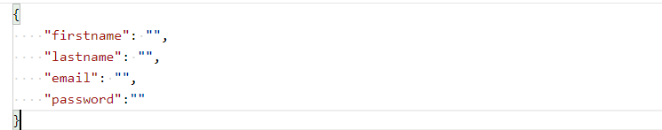
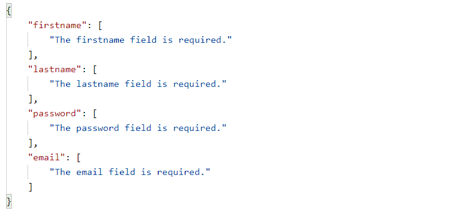
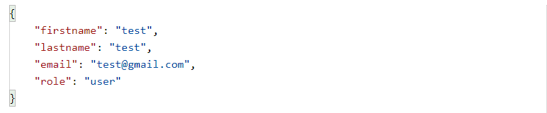
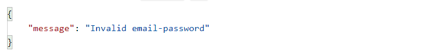
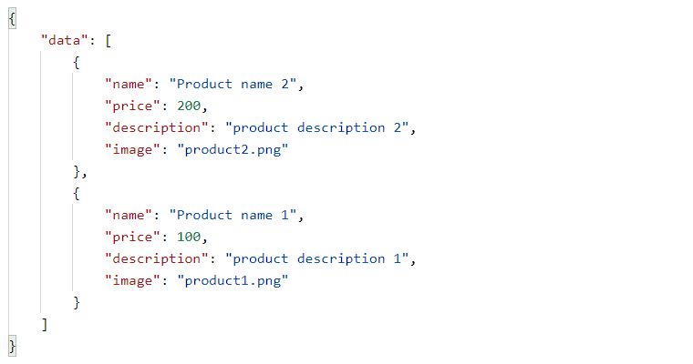
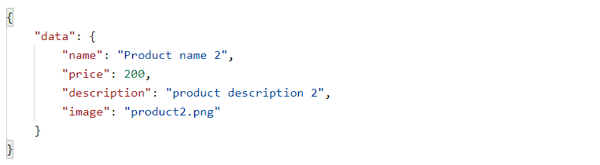
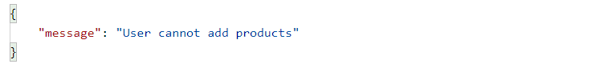
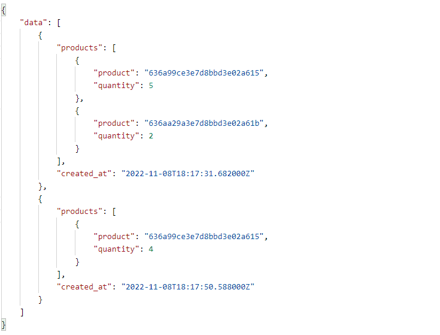

# RESTful API

## Topics
- Laravel
- MongoDB
- Sanctum
- Jwt

### Create User

### Register Validation

### User

### Invalid User

### Get Products

### Find Product

### User Role cannot Add Product

### Get Orders
